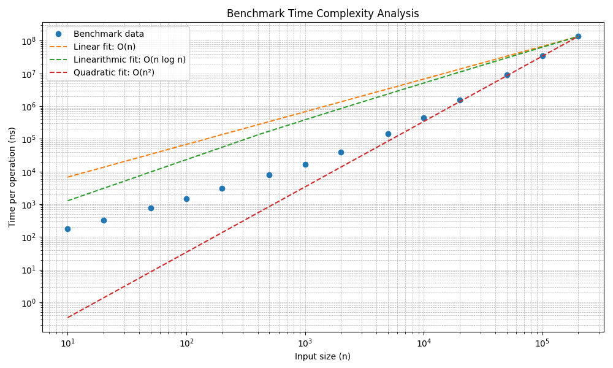

# Layup Sequence Benchmark

## Running the Program

You can run the program with:

```bash
go run layup_sequence.go
```

Or build and run the binary:

```bash
go build -o layup-sequence
./layup-sequence
```

### Command-Line Argument

The program accepts a single argument:

```
-n=VALUE
```

- `VALUE` must be an integer **between 3 and 100000**
- If omitted, the default is **10000**

Example:

```bash
./layup-sequence -n=5000
```

## Algorithm Overview

The algorithm computes the `n`-th term by iterating linearly from 1 to `n`. At each step, the current value is calculated based on the two preceding values.

- Uses Go's `math/big` standard library for arbitrary-precision arithmetic, allowing it to handle very large integers.

## Time Complexity

Although the algorithm performs `O(n)` steps, each step involves operations on increasingly large integers. This significantly impacts real-world performance:

- The size of the integers grows roughly **exponentially**, so the **number of digits** grows **linearly** with `n`.
- Integer operations like addition and multiplication scale with the number of digits:
    - Addition: `O(d)`
    - Multiplication: `O(d log d)` or worse

As a result, the actual time complexity lies between:

```
O(n log n) and O(n²)
```

As you can see, the performance initially looks to be scaling linearly, but becomes more in line with an exponential growth as the number of digits increases.


## Optimization Notes

One key optimization during development:

- I initially used a slice to hold all the previously computed values in the sequence, but I realized I only needed to keep track of the most recent 2, so I switched my slice for two discrete variables.
